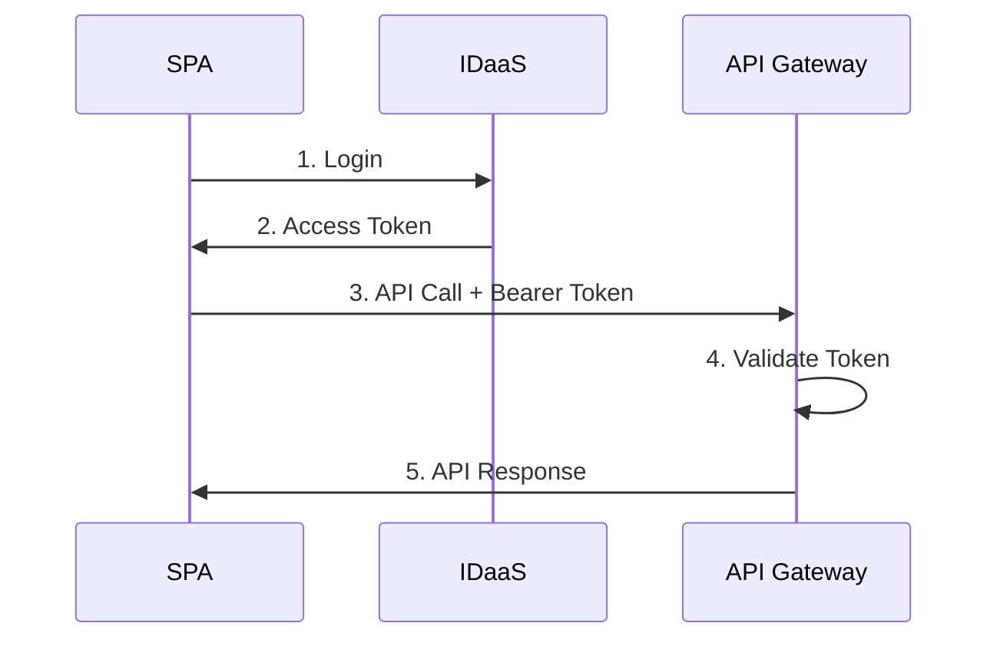

# AWS API Gateway Authentication with IDaaS Auth JS SDK

This guide demonstrates how to build a secure authentication solution for AWS API Gateway using the IDaaS Auth JS SDK for your Single Page Application (SPA) frontend.

---

## Table of Contents

- [Overview](#overview)
- [Prerequisites](#prerequisites)
- [Quick Start](#quick-start)
- [Frontend Setup (SPA)](#frontend-setup-spa)
- [Troubleshooting](#troubleshooting)
- [Additional Resources](#additional-resources)

---

## Overview

This guide shows how to use the IDaaS Auth JS SDK in a Single Page Application (SPA) that calls AWS API Gateway protected endpoints.

**Architecture:**

1. **SPA** - Uses IDaaS SDK for authentication
2. **IDaaS** - Handles user login and issues JWT access tokens
3. **API Gateway** - Validates tokens via Lambda authorizer
4. **Backend** - Your Lambda functions protected by the authorizer

### Authentication Flow



---

## Prerequisites

**IDaaS Configuration:**

1. [Create an IDaaS account](https://in.entrust.com/IDaaS/) (free trial available)
2. Create an OIDC Application with your redirect URIs
3. Create a Resource Server with audience URL (e.g., `https://api.example.com`)
4. Define scopes (e.g., `read:users`, `write:users`, `delete:users`)
5. Note your `issuerUrl` and `clientId`

**AWS Setup:**

- AWS API Gateway (REST API)
- Lambda authorizer for JWT validation (see [sample implementation](https://github.com/EntrustCorporation/aws-api-gateway-authorizer-sample))
- Backend Lambda functions

---

## Quick Start

```bash
npm install @entrustcorp/idaas-auth-js
```

```typescript
import { IdaasClient } from "@entrustcorp/idaas-auth-js";

// Initialize SDK
const client = new IdaasClient(
  {
    issuerUrl: "https://your-tenant.trustedauth.com/api/oidc",
    clientId: "your-client-id",
    storageType: "memory"
  },
  {
    audience: "https://api.example.com",
    scope: "openid profile read:users write:users"
  }
);

// Login
await client.oidc.login({ redirectUri: window.location.origin });

// Handle callback (returns null if not a callback URL)
await client.oidc.handleRedirect();

// Call API
const token = await client.getAccessToken();
const response = await fetch("https://api.example.com/users", {
  headers: { Authorization: `Bearer ${token}` }
});
```

---

## Frontend Setup (SPA)

### Step 1: Initialize the SDK

```typescript
// src/auth/idaasClient.ts
import { IdaasClient } from "@entrustcorp/idaas-auth-js";

export const idaasClient = new IdaasClient(
  {
    issuerUrl: "https://your-tenant.trustedauth.com/api/oidc",
    clientId: "your-client-id",
    storageType: "memory" // or 'localstorage' for persistence
  },
  {
    audience: "https://api.example.com",
    scope: "openid profile read:users write:users delete:users",
    useRefreshToken: true // Optional: Enable refresh tokens for long-lived sessions
  }
);
```

### Step 2: Implement Authentication Flow

#### React Example

```typescript
// src/hooks/useAuth.tsx
import { useState, useEffect } from "react";
import { idaasClient } from "../auth/idaasClient";

export function useAuth() {
  const [isAuthenticated, setIsAuthenticated] = useState(false);
  const [isLoading, setIsLoading] = useState(true);

  useEffect(() => {
    checkAuth();
  }, []);

  async function checkAuth() {
    try {
      // Handle OAuth callback (returns null if not a callback URL)
      await idaasClient.oidc.handleRedirect();

      // Check if user is authenticated
      const authenticated = await idaasClient.isAuthenticated();
      setIsAuthenticated(authenticated);
    } catch (error) {
      console.error("Authentication error:", error);
      setIsAuthenticated(false);
    } finally {
      setIsLoading(false);
    }
  }

  async function login() {
    try {
      await idaasClient.oidc.login({
        redirectUri: window.location.origin
      });
    } catch (error) {
      console.error("Login error:", error);
      throw error;
    }
  }

  async function logout() {
    try {
      await idaasClient.oidc.logout({
        redirectUri: window.location.origin
      });
    } catch (error) {
      console.error("Logout error:", error);
    }
  }

  return {
    isAuthenticated,
    isLoading,
    login,
    logout
  };
}
```

#### Using the Hook

```tsx
// src/App.tsx
import { useAuth } from "./hooks/useAuth";

function App() {
  const { isAuthenticated, isLoading, login, logout } = useAuth();

  if (isLoading) {
    return <div>Loading...</div>;
  }

  if (!isAuthenticated) {
    return (
      <div>
        <h1>Welcome</h1>
        <button onClick={login}>Login</button>
      </div>
    );
  }

  return (
    <div>
      <h1>Dashboard</h1>
      <button onClick={logout}>Logout</button>
    </div>
  );
}
```

### Step 3: Create API Client with Automatic Token Injection

```typescript
// src/api/apiClient.ts
import { idaasClient } from "../auth/idaasClient";

class ApiClient {
  private baseUrl = "https://api.example.com";

  private async request<T>(endpoint: string, options: RequestInit = {}): Promise<T> {
    try {
      // Get access token (automatically refreshed if expired)
      const accessToken = await idaasClient.getAccessToken();

      // Build headers - only set Content-Type if there's a body
      const headers: HeadersInit = {
        Authorization: `Bearer ${accessToken}`,
        ...options.headers
      };

      if (options.body) {
        headers["Content-Type"] = "application/json";
      }

      // Make API request with Bearer token
      const response = await fetch(`${this.baseUrl}${endpoint}`, {
        ...options,
        headers
      });

      if (!response.ok) {
        throw new Error(`API error: ${response.status}`);
      }

      return response.json();
    } catch (error) {
      console.error("API request failed:", error);
      throw error;
    }
  }

  // API methods
  async getUsers() {
    return this.request<User[]>("/api/v1/users");
  }

  async createUser(user: CreateUserDto) {
    return this.request<User>("/api/v1/users", {
      method: "POST",
      body: JSON.stringify(user)
    });
  }

  async updateUser(userId: string, user: UpdateUserDto) {
    return this.request<User>(`/api/v1/users/${userId}`, {
      method: "PUT",
      body: JSON.stringify(user)
    });
  }

  async deleteUser(userId: string) {
    return this.request<void>(`/api/v1/users/${userId}`, {
      method: "DELETE"
    });
  }
}

export const apiClient = new ApiClient();

// TypeScript types
interface User {
  id: string;
  email: string;
  name: string;
}

interface CreateUserDto {
  email: string;
  name: string;
}

interface UpdateUserDto {
  name?: string;
}
```

### Step 4: Use API Client in Components

```tsx
// src/components/UserList.tsx
import { useState, useEffect } from "react";
import { apiClient } from "../api/apiClient";

function UserList() {
  const [users, setUsers] = useState([]);
  const [loading, setLoading] = useState(true);
  const [error, setError] = useState(null);

  useEffect(() => {
    loadUsers();
  }, []);

  async function loadUsers() {
    try {
      setLoading(true);
      const data = await apiClient.getUsers();
      setUsers(data);
    } catch (err) {
      setError(err.message);
    } finally {
      setLoading(false);
    }
  }

  if (loading) return <div>Loading users...</div>;
  if (error) return <div>Error: {error}</div>;

  return (
    <ul>
      {users.map((user) => (
        <li key={user.id}>
          {user.name} ({user.email})
        </li>
      ))}
    </ul>
  );
}
```

---

## Troubleshooting

### Token Not Found After Redirect

**Problem:** `isAuthenticated()` returns false after login

**Solution:** Ensure you're calling `handleRedirect()` (which automatically clears URL parameters and returns `null` if not a callback URL) and consider using `localstorage` for persistence:

```typescript
// Call unconditionally - handles non-callback URLs gracefully
await client.oidc.handleRedirect();
```

### 401 Unauthorized from API

**Problem:** API rejects valid-looking token

**Solution:** Verify token claims match API Gateway configuration:

```typescript
const claims = await client.getIdTokenClaims();
console.log("Audience:", claims.aud); // Should match API Gateway audience
console.log("Issuer:", claims.iss); // Should match IDaaS issuer
console.log("Expires:", new Date(claims.exp * 1000));
```

### Infinite Redirect Loop

**Problem:** Browser keeps redirecting

**Solution:** The SDK automatically clears URL parameters when `handleRedirect()` is called. If you're still experiencing loops, ensure you're not calling `login()` again after successful authentication:

```typescript
// Call handleRedirect() unconditionally
await client.oidc.handleRedirect();

// Ensure you check authentication status before calling login()
const isAuthenticated = await client.isAuthenticated();
if (!isAuthenticated) {
  await client.oidc.login({ redirectUri: window.location.origin });
}
```

---

## Additional Resources

- **SDK API Reference:** [API Documentation](../api/README.md)
- **Security Best Practices:** [Security Guide](./security-best-practices.md)
- **Lambda Authorizer Sample:** [GitHub Repository](https://github.com/EntrustCorporation/aws-api-gateway-authorizer-sample)
- **SDK Issues:** [GitHub Issues](https://github.com/EntrustCorporation/idaas-auth-js/issues)
