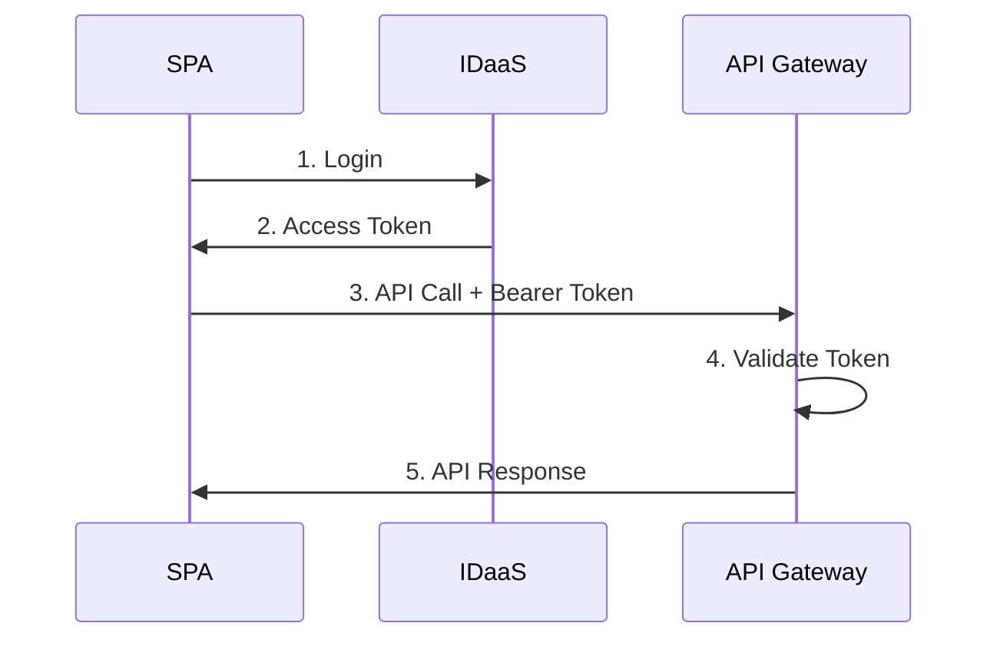
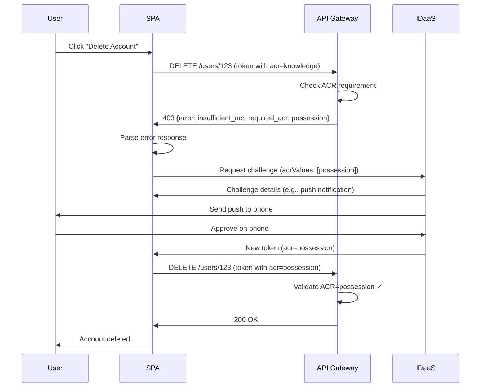

# AWS API Gateway Authentication with IDaaS Auth JS SDK

This guide demonstrates how to build a secure authentication solution for AWS API Gateway using the IDaaS Auth JS SDK for your Single Page Application (SPA) frontend.

---

## Table of Contents

- [Overview](#overview)
- [Prerequisites](#prerequisites)
- [Quick Start](#quick-start)
- [Frontend Setup (SPA)](#frontend-setup-spa)
- [Step-Up Authentication](#step-up-authentication)
- [Troubleshooting](#troubleshooting)
- [Additional Resources](#additional-resources)

---

## Overview

This guide shows how to use the IDaaS Auth JS SDK in a Single Page Application (SPA) that calls AWS API Gateway protected endpoints.

**Architecture:**

1. **SPA** - Uses IDaaS SDK for authentication
2. **IDaaS** - Handles user login and issues JWT access tokens
3. **API Gateway** - Validates tokens via Lambda authorizer
4. **Backend** - Your Lambda functions protected by the authorizer

### Authentication Flow



---

## Prerequisites

**IDaaS Configuration:**

1. [Create an IDaaS account](https://in.entrust.com/IDaaS/) (free trial available)
2. Create an OIDC Application with your redirect URIs
3. Create a Resource Server with audience URL (e.g., `https://api.example.com`)
4. Define scopes (e.g., `read:users`, `write:users`, `delete:users`)
5. Note your `issuerUrl` and `clientId`

**AWS Setup:**

- AWS API Gateway (REST API)
- Lambda authorizer for JWT validation (see [sample implementation](https://github.com/EntrustCorporation/aws-api-gateway-authorizer-sample))
- Backend Lambda functions

---

## Quick Start

```bash
npm install @entrustcorp/idaas-auth-js
```

```typescript
import { IdaasClient } from "@entrustcorp/idaas-auth-js";

// Initialize SDK
const client = new IdaasClient(
  {
    issuerUrl: "https://your-tenant.trustedauth.com/api/oidc",
    clientId: "your-client-id",
    storageType: "memory"
  },
  {
    audience: "https://api.example.com",
    scope: "openid profile read:users write:users"
  }
);

// Login
await client.oidc.login({ redirectUri: window.location.origin });

// Handle callback (returns null if not a callback URL)
await client.oidc.handleRedirect();

// Call API
const token = await client.getAccessToken();
const response = await fetch("https://api.example.com/users", {
  headers: { Authorization: `Bearer ${token}` }
});
```

---

## Frontend Setup (SPA)

### Step 1: Initialize the SDK

```typescript
// src/auth/idaasClient.ts
import { IdaasClient } from "@entrustcorp/idaas-auth-js";

export const idaasClient = new IdaasClient(
  {
    issuerUrl: "https://your-tenant.trustedauth.com/api/oidc",
    clientId: "your-client-id",
    storageType: "memory" // or 'localstorage' for persistence
  },
  {
    audience: "https://api.example.com",
    scope: "openid profile read:users write:users delete:users",
    useRefreshToken: true // Optional: Enable refresh tokens for long-lived sessions
  }
);
```

### Step 2: Implement Authentication Flow

#### React Example

```typescript
// src/hooks/useAuth.tsx
import { useState, useEffect } from "react";
import { idaasClient } from "../auth/idaasClient";

export function useAuth() {
  const [isAuthenticated, setIsAuthenticated] = useState(false);
  const [isLoading, setIsLoading] = useState(true);

  useEffect(() => {
    checkAuth();
  }, []);

  async function checkAuth() {
    try {
      // Handle OAuth callback (returns null if not a callback URL)
      await idaasClient.oidc.handleRedirect();

      // Check if user is authenticated
      const authenticated = await idaasClient.isAuthenticated();
      setIsAuthenticated(authenticated);
    } catch (error) {
      console.error("Authentication error:", error);
      setIsAuthenticated(false);
    } finally {
      setIsLoading(false);
    }
  }

  async function login() {
    try {
      await idaasClient.oidc.login({
        redirectUri: window.location.origin
      });
    } catch (error) {
      console.error("Login error:", error);
      throw error;
    }
  }

  async function logout() {
    try {
      await idaasClient.oidc.logout({
        redirectUri: window.location.origin
      });
    } catch (error) {
      console.error("Logout error:", error);
    }
  }

  return {
    isAuthenticated,
    isLoading,
    login,
    logout
  };
}
```

#### Using the Hook

```tsx
// src/App.tsx
import { useAuth } from "./hooks/useAuth";

function App() {
  const { isAuthenticated, isLoading, login, logout } = useAuth();

  if (isLoading) {
    return <div>Loading...</div>;
  }

  if (!isAuthenticated) {
    return (
      <div>
        <h1>Welcome</h1>
        <button onClick={login}>Login</button>
      </div>
    );
  }

  return (
    <div>
      <h1>Dashboard</h1>
      <button onClick={logout}>Logout</button>
    </div>
  );
}
```

### Step 3: Create API Client with Automatic Token Injection

```typescript
// src/api/apiClient.ts
import { idaasClient } from "../auth/idaasClient";

class ApiClient {
  private baseUrl = "https://api.example.com";

  private async request<T>(endpoint: string, options: RequestInit = {}): Promise<T> {
    try {
      // Get access token (automatically refreshed if expired)
      const accessToken = await idaasClient.getAccessToken();

      // Build headers - only set Content-Type if there's a body
      const headers: HeadersInit = {
        Authorization: `Bearer ${accessToken}`,
        ...options.headers
      };

      if (options.body) {
        headers["Content-Type"] = "application/json";
      }

      // Make API request with Bearer token
      const response = await fetch(`${this.baseUrl}${endpoint}`, {
        ...options,
        headers
      });

      if (!response.ok) {
        throw new Error(`API error: ${response.status}`);
      }

      return response.json();
    } catch (error) {
      console.error("API request failed:", error);
      throw error;
    }
  }

  // API methods
  async getUsers() {
    return this.request<User[]>("/api/v1/users");
  }

  async createUser(user: CreateUserDto) {
    return this.request<User>("/api/v1/users", {
      method: "POST",
      body: JSON.stringify(user)
    });
  }

  async updateUser(userId: string, user: UpdateUserDto) {
    return this.request<User>(`/api/v1/users/${userId}`, {
      method: "PUT",
      body: JSON.stringify(user)
    });
  }

  async deleteUser(userId: string) {
    return this.request<void>(`/api/v1/users/${userId}`, {
      method: "DELETE"
    });
  }
}

export const apiClient = new ApiClient();

// TypeScript types
interface User {
  id: string;
  email: string;
  name: string;
}

interface CreateUserDto {
  email: string;
  name: string;
}

interface UpdateUserDto {
  name?: string;
}
```

### Step 4: Use API Client in Components

```tsx
// src/components/UserList.tsx
import { useState, useEffect } from "react";
import { apiClient } from "../api/apiClient";

function UserList() {
  const [users, setUsers] = useState([]);
  const [loading, setLoading] = useState(true);
  const [error, setError] = useState(null);

  useEffect(() => {
    loadUsers();
  }, []);

  async function loadUsers() {
    try {
      setLoading(true);
      const data = await apiClient.getUsers();
      setUsers(data);
    } catch (err) {
      setError(err.message);
    } finally {
      setLoading(false);
    }
  }

  if (loading) return <div>Loading users...</div>;
  if (error) return <div>Error: {error}</div>;

  return (
    <ul>
      {users.map((user) => (
        <li key={user.id}>
          {user.name} ({user.email})
        </li>
      ))}
    </ul>
  );
}
```

---

## Step-Up Authentication

Step-up authentication requires additional verification for sensitive operations like deleting accounts or transferring money. This is achieved using Authentication Context Class Reference (ACR) values that indicate the strength of authentication used.

### Understanding ACR Values

ACR values represent authentication strength levels:

- **`knowledge`** - Something you know (password, security questions)
- **`possession`** - Something you have (authenticator app, hardware token, push notification)
- **`inherence`** - Something you are (biometric, face recognition)

Tokens include an `acr` claim indicating how the user authenticated. Your API Gateway Lambda authorizer can enforce minimum ACR requirements for sensitive endpoints.

### How It Works

1. User attempts sensitive operation (e.g., delete account)
2. API returns 403 with error indicating required ACR level
3. SPA triggers step-up authentication (MFA, biometric, etc.)
4. User completes additional authentication
5. SDK obtains new token with elevated ACR claim
6. SPA retries request with elevated token
7. API validates ACR and allows operation



### Frontend Implementation

The backend Lambda enforces ACR requirements and returns error details in the response body. When the SPA makes a request with insufficient ACR, the API returns 403 Forbidden with information about the required ACR level. The SPA parses this and triggers appropriate step-up authentication.

#### Complete Example: Delete User with Step-Up

```typescript
async function deleteUser(userId: string, userEmail: string) {
  try {
    // Attempt API call with current token
    const accessToken = await idaasClient.getAccessToken();
    const response = await fetch(`https://api.example.com/users/${userId}`, {
      method: "DELETE",
      headers: { Authorization: `Bearer ${accessToken}` }
    });

    // Backend denied due to insufficient ACR
    if (response.status === 403) {
      const errorBody = await response.json();

      // Check if it's an ACR-related error
      if (errorBody.error === "insufficient_acr" && errorBody.required_acr) {
        // Trigger step-up authentication with required ACR level
        await performStepUp(userEmail, [errorBody.required_acr]);

        // Retry with new elevated token
        return deleteUser(userId, userEmail);
      }

      // Other 403 error (e.g., missing scopes, permissions)
      throw new Error(errorBody.message || "Access denied");
    }

    if (!response.ok) {
      throw new Error(`Delete failed: ${response.status}`);
    }

    return await response.json();
  } catch (error) {
    console.error("Delete user failed:", error);
    throw error;
  }
}

async function performStepUp(userEmail: string, acrValues: string[]) {
  // Option 1: In-app challenge (better UX)
  // Let IDaaS determine the appropriate authentication method based on ACR
  const { method, pollForCompletion } = await idaasClient.rba.requestChallenge(
    { userId: userEmail },
    { acrValues }
  );

  if (pollForCompletion) {
    const result = await idaasClient.rba.poll();
    if (!result.authenticationCompleted) {
      throw new Error("MFA verification failed");
    }
  }

  // Prompt for appropriate authentication method based on 'method' returned
  // e.g., show OTP input, etc.

  // Option 2: Redirect-based step-up (simpler but loses page state)
  // await idaasClient.oidc.login(
  //   { redirectUri: window.location.href },
  //   { acrValues }
  // );
}
```

**Key Points:**

1. **Backend enforces ACR** - Backend Lambda checks token ACR claim and returns detailed error
2. **Error body includes required ACR** - Response includes `error: "insufficient_acr"` and `required_acr: "possession"`
3. **SPA parses requirements** - Frontend extracts required ACR level from error response
4. **Dynamic step-up** - Triggers appropriate authentication based on backend requirements
5. **Retry request** - After step-up, SDK has new token with elevated ACR.

### Backend Implementation

#### Lambda Authorizer - Basic Token Validation

The Lambda authorizer validates JWT signature, issuer, audience, and scopes. It passes token claims to backend Lambda functions via the authorizer context:

```typescript
import { createRemoteJWKSet, jwtVerify } from "jose";

export async function handler(event) {
  try {
    const token = event.authorizationToken.replace("Bearer ", "");

    // Validate JWT signature and claims
    const jwks = createRemoteJWKSet(new URL(process.env.JWKS_URI));
    const { payload } = await jwtVerify(token, jwks, {
      issuer: process.env.ISSUER,
      audience: process.env.AUDIENCE
    });

    // Validate scopes
    const tokenScopes = (payload.scope as string).split(" ");
    const requiredScopes = getRequiredScopes(event.methodArn);

    if (!requiredScopes.every((scope) => tokenScopes.includes(scope))) {
      return generatePolicy(payload.sub, "Deny", event.methodArn);
    }

    // Pass token claims to backend Lambda via context
    return generatePolicy(payload.sub, "Allow", event.methodArn, {
      acr: payload.acr || "",
      scope: payload.scope,
      sub: payload.sub
    });
  } catch (error) {
    console.error("Authorization failed:", error);
    throw new Error("Unauthorized");
  }
}

function getRequiredScopes(methodArn: string): string[] {
  if (methodArn.includes("GET")) return ["read:users"];
  if (methodArn.includes("DELETE")) return ["delete:users"];
  if (methodArn.includes("POST") || methodArn.includes("PUT")) return ["write:users"];
  return [];
}

function generatePolicy(
  principalId: string,
  effect: string,
  resource: string,
  context?: Record<string, string>
) {
  return {
    principalId,
    policyDocument: {
      Version: "2012-10-17",
      Statement: [
        {
          Action: "execute-api:Invoke",
          Effect: effect,
          Resource: resource
        }
      ]
    },
    context // Pass claims to backend Lambda
  };
}
```

#### Backend Lambda - ACR Validation with Error Details

Backend Lambda functions validate ACR requirements and return detailed error responses that tell the frontend exactly what's needed:

```typescript
export async function deleteUserHandler(event) {
  try {
    const userId = event.pathParameters.userId;

    // Get ACR from authorizer context (passed from Lambda authorizer)
    const acr = event.requestContext.authorizer.acr;

    // Check if ACR meets requirements for this sensitive operation
    if (acr !== "possession") {
      return {
        statusCode: 403,
        headers: {
          "Content-Type": "application/json",
          "Access-Control-Allow-Origin": "*" // Configure appropriately
        },
        body: JSON.stringify({
          error: "insufficient_acr",
          required_acr: "possession",
          current_acr: acr || "none",
          message: "This operation requires multi-factor authentication"
        })
      };
    }

    // Proceed with deletion if ACR is sufficient
    await deleteUser(userId);

    return {
      statusCode: 200,
      body: JSON.stringify({ message: "User deleted successfully" })
    };
  } catch (error) {
    console.error("Error:", error);
    return {
      statusCode: 500,
      body: JSON.stringify({ error: "Internal server error" })
    };
  }
}
```

**Benefits of this approach:**

1. ✅ **Dynamic requirements** - Frontend learns required ACR from backend response
2. ✅ **Flexible per-endpoint** - Each Lambda function can specify its own ACR requirements
3. ✅ **Clear error handling** - Frontend can distinguish ACR errors from other 403 errors
4. ✅ **Better UX** - Frontend can show specific messages ("This requires MFA" vs "Access denied")
5. ✅ **Works with API Gateway** - No need for custom HTTP headers that authorizers can't set

### Testing Step-Up Authentication

1. **Initial login with password** (creates token with `acr="knowledge"`)
2. **Attempt sensitive operation** (requires `acr="possession"`)
3. **SDK triggers step-up** (MFA challenge)
4. **Complete MFA** (push notification, authenticator app, etc.)
5. **New token issued** with `acr="possession"`
6. **API call succeeds** with elevated token

You can inspect the ACR value in tokens:

```typescript
const claims = await idaasClient.getIdTokenClaims();
console.log("Current ACR:", claims.acr); // "knowledge" or "possession"
```

---

## Troubleshooting

### Token Not Found After Redirect

**Problem:** `isAuthenticated()` returns false after login

**Solution:** Ensure you're calling `handleRedirect()` (which automatically clears URL parameters and returns `null` if not a callback URL) and consider using `localstorage` for persistence:

```typescript
// Call unconditionally - handles non-callback URLs gracefully
await client.oidc.handleRedirect();
```

### 401 Unauthorized from API

**Problem:** API rejects valid-looking token

**Solution:** Verify token claims match API Gateway configuration:

```typescript
const claims = await client.getIdTokenClaims();
console.log("Audience:", claims.aud); // Should match API Gateway audience
console.log("Issuer:", claims.iss); // Should match IDaaS issuer
console.log("Expires:", new Date(claims.exp * 1000));
```

### Infinite Redirect Loop

**Problem:** Browser keeps redirecting

**Solution:** The SDK automatically clears URL parameters when `handleRedirect()` is called. If you're still experiencing loops, ensure you're not calling `login()` again after successful authentication:

```typescript
// Call handleRedirect() unconditionally
await client.oidc.handleRedirect();

// Ensure you check authentication status before calling login()
const isAuthenticated = await client.isAuthenticated();
if (!isAuthenticated) {
  await client.oidc.login({ redirectUri: window.location.origin });
}
```

---

## Additional Resources

- **SDK API Reference:** [API Documentation](../api/README.md)
- **Security Best Practices:** [Security Guide](./security-best-practices.md)
- **Lambda Authorizer Sample:** [GitHub Repository](https://github.com/EntrustCorporation/aws-api-gateway-authorizer-sample)
- **SDK Issues:** [GitHub Issues](https://github.com/EntrustCorporation/idaas-auth-js/issues)
