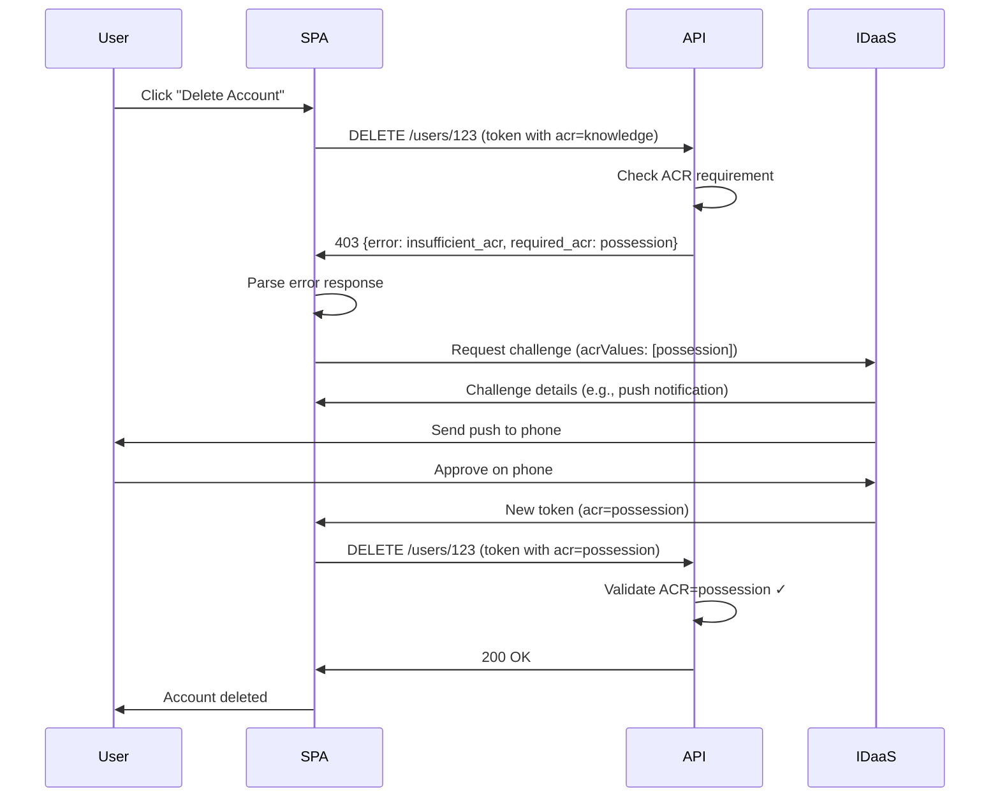

# Step-Up Authentication with IDaaS Auth JS SDK

This guide explains how to implement step-up authentication for sensitive operations using the IDaaS Auth JS SDK. Step-up authentication requires users to provide additional verification (MFA, biometrics, etc.) beyond their initial login when performing high-risk actions.

---

## Table of Contents

- [Overview](#overview)
- [Understanding ACR Values](#understanding-acr-values)
- [Prerequisites](#prerequisites)
- [How It Works](#how-it-works)
- [Frontend Implementation](#frontend-implementation)
- [Backend Implementation](#backend-implementation)
- [Token Management](#token-management)
- [Testing](#testing)
- [Additional Resources](#additional-resources)

---

## Overview

Step-up authentication enhances security by requiring additional verification for sensitive operations like:

- Deleting user accounts
- Transferring money
- Changing security settings
- Accessing sensitive data
- High-value transactions

Rather than forcing users to always use MFA, step-up lets them authenticate with a simpler method (password) for routine operations, then "step up" to stronger authentication only when needed.

---

## Understanding ACR Values

Authentication Context Class Reference (ACR) values indicate the strength of authentication used:

- **`knowledge`** - Something you know (password, security questions, KBA)
- **`possession`** - Something you have (authenticator app, hardware token, push notification, OTP)
- **`inherence`** - Something you are (biometric, face recognition, FIDO)

Tokens include an `acr` claim that your backend can validate to ensure appropriate authentication strength was used.

---

## Prerequisites

**IDaaS Configuration:**

1. Create a Resource Server in IDaaS with your API audience URL (e.g., `https://api.example.com`)

2. Create a **Resource Rule** with basic authenticator for standard operations:
   - Set audience to your Resource Server
   - Set required scopes (e.g., `read:users`, `write:users`)
   - Configure basic authenticator (password, OTP, etc.)
   - No ACR filter required

3. Create a second **Resource Rule** with ACR-based access filter for sensitive operations:
   - Set audience to your Resource Server
   - Set required scopes (e.g., `delete:users`, `transfer:money`)
   - Add **ACR-based access filter** requiring `possession` or `inherence`
   - Configure strong authenticator (FACE biometric, FIDO, soft token push, etc.)

**Note:** Resource Rules enable dynamic authentication method selection. When the SPA requests a token with specific ACR values, IDaaS uses the matching Resource Rule to determine which authentication method to present.

---

## How It Works



**Flow:**

1. User attempts sensitive operation (e.g., delete account)
2. API validates token and checks ACR claim
3. If ACR insufficient, API returns 403 with required ACR details
4. SPA triggers step-up authentication with required ACR level
5. User completes additional authentication (MFA, biometric, etc.)
6. SDK obtains new token with elevated ACR claim
7. SPA retries request with elevated token
8. API validates elevated ACR and allows operation

---

## Frontend Implementation

### Complete Example: Delete User with Step-Up

```typescript
import { idaasClient } from "../auth/idaasClient";

async function deleteUser(userId: string, userEmail: string) {
  try {
    // Attempt API call with current token
    const accessToken = await idaasClient.getAccessToken();
    const response = await fetch(`https://api.example.com/users/${userId}`, {
      method: "DELETE",
      headers: { Authorization: `Bearer ${accessToken}` }
    });

    // Backend denied due to insufficient ACR
    if (response.status === 403) {
      const errorBody = await response.json();

      // Check if it's an ACR-related error
      if (errorBody.error === "insufficient_acr" && errorBody.required_acr) {
        // Trigger step-up authentication with required ACR level
        await performStepUp(userEmail, [errorBody.required_acr]);

        // Retry with new elevated token
        return deleteUser(userId, userEmail);
      }

      // Other 403 error (e.g., missing scopes, permissions)
      throw new Error(errorBody.message || "Access denied");
    }

    if (!response.ok) {
      throw new Error(`Delete failed: ${response.status}`);
    }

    return await response.json();
  } catch (error) {
    console.error("Delete user failed:", error);
    throw error;
  }
}

async function performStepUp(userEmail: string, acrValues: string[]) {
  // Option 1: In-app challenge (better UX)
  // Let IDaaS determine the appropriate authentication method based on ACR
  const { method, pollForCompletion } = await idaasClient.rba.requestChallenge(
    { userId: userEmail },
    {
      acrValues,
      maxAge: 0 // Require fresh authentication for each sensitive operation
    }
  );

  if (pollForCompletion) {
    const result = await idaasClient.rba.poll();
    if (!result.authenticationCompleted) {
      throw new Error("MFA verification failed");
    }
  }

  // For non-polling methods, prompt for appropriate input based on 'method' returned
  // e.g., show OTP input, grid card UI, etc.

  // Option 2: Redirect-based step-up (simpler but loses page state)
  // await idaasClient.oidc.login(
  //   { redirectUri: window.location.href },
  //   { acrValues, maxAge: 0 } // Require fresh authentication
  // );
}
```

**Key Points:**

1. **Backend enforces ACR** - Backend validates token ACR claim and returns detailed error
2. **Error body includes required ACR** - Response includes `error: "insufficient_acr"` and `required_acr: "possession"`
3. **SPA parses requirements** - Frontend extracts required ACR level from error response
4. **Dynamic step-up** - Triggers appropriate authentication based on backend requirements
5. **max_age=0** - Ensures fresh authentication for each sensitive operation (prevents session reuse)
6. **Retry request** - After step-up, SDK has new token with elevated ACR

---

## Backend Implementation

### Lambda Authorizer - Token Validation

The Lambda authorizer validates JWT signature, issuer, audience, and scopes. It passes token claims to backend Lambda functions via the authorizer context:

```typescript
import { createRemoteJWKSet, jwtVerify } from "jose";

export async function handler(event) {
  try {
    const token = event.authorizationToken.replace("Bearer ", "");

    // Validate JWT signature and claims
    const jwks = createRemoteJWKSet(new URL(process.env.JWKS_URI));
    const { payload } = await jwtVerify(token, jwks, {
      issuer: process.env.ISSUER,
      audience: process.env.AUDIENCE
    });

    // Validate scopes
    const tokenScopes = (payload.scope as string).split(" ");
    const requiredScopes = getRequiredScopes(event.methodArn);

    if (!requiredScopes.every((scope) => tokenScopes.includes(scope))) {
      return generatePolicy(payload.sub, "Deny", event.methodArn);
    }

    // Pass token claims to backend Lambda via context
    return generatePolicy(payload.sub, "Allow", event.methodArn, {
      acr: payload.acr || "",
      scope: payload.scope,
      sub: payload.sub
    });
  } catch (error) {
    console.error("Authorization failed:", error);
    throw new Error("Unauthorized");
  }
}

function getRequiredScopes(methodArn: string): string[] {
  if (methodArn.includes("GET")) return ["read:users"];
  if (methodArn.includes("DELETE")) return ["delete:users"];
  if (methodArn.includes("POST") || methodArn.includes("PUT")) return ["write:users"];
  return [];
}

function generatePolicy(
  principalId: string,
  effect: string,
  resource: string,
  context?: Record<string, string>
) {
  return {
    principalId,
    policyDocument: {
      Version: "2012-10-17",
      Statement: [
        {
          Action: "execute-api:Invoke",
          Effect: effect,
          Resource: resource
        }
      ]
    },
    context // Pass claims to backend Lambda
  };
}
```

### Backend Lambda - ACR Validation

Backend Lambda functions validate ACR requirements and return detailed error responses:

```typescript
export async function deleteUserHandler(event) {
  try {
    const userId = event.pathParameters.userId;

    // Get ACR from authorizer context (passed from Lambda authorizer)
    const acr = event.requestContext.authorizer.acr;

    // Check if ACR meets requirements for this sensitive operation
    if (acr !== "possession" && acr !== "inherence") {
      return {
        statusCode: 403,
        headers: {
          "Content-Type": "application/json",
          "Access-Control-Allow-Origin": "*" // Configure appropriately
        },
        body: JSON.stringify({
          error: "insufficient_acr",
          required_acr: "possession", // Or "inherence" for biometric
          current_acr: acr || "none",
          message: "This operation requires multi-factor authentication"
        })
      };
    }

    // Proceed with deletion if ACR is sufficient
    await deleteUser(userId);

    return {
      statusCode: 200,
      body: JSON.stringify({ message: "User deleted successfully" })
    };
  } catch (error) {
    console.error("Error:", error);
    return {
      statusCode: 500,
      body: JSON.stringify({ error: "Internal server error" })
    };
  }
}
```

**Benefits of this approach:**

1. ✅ **Dynamic requirements** - Frontend learns required ACR from backend response
2. ✅ **Flexible per-endpoint** - Each Lambda function can specify its own ACR requirements
3. ✅ **Clear error handling** - Frontend can distinguish ACR errors from other 403 errors
4. ✅ **Better UX** - Frontend can show specific messages ("This requires MFA" vs "Access denied")
5. ✅ **Works with API Gateway** - No need for custom HTTP headers that authorizers can't set

---

## Token Management

### How the SDK Stores Multiple Tokens

The SDK manages multiple access tokens simultaneously, storing each token with its unique combination of:

- **Audience** (e.g., `https://api.example.com`)
- **Scopes** (e.g., `read:users write:users`)
- **ACR value** (e.g., `knowledge`, `possession`, `inherence`)

When you call `getAccessToken(options)`, the SDK:

1. Finds all tokens matching the requested audience
2. Filters to tokens containing ALL requested scopes
3. If ACR values provided, filters to tokens with matching ACR
4. Returns the token with the **fewest scopes** (most specific match)

### Token Isolation Pattern

After step-up authentication with elevated ACR, you have **two separate tokens**:

```typescript
// After initial login (password)
await idaasClient.oidc.login({ redirectUri: window.location.origin });
// Token stored: { audience: "https://api.example.com", scope: "read:users write:users", acr: "knowledge" }

// After step-up (MFA for sensitive operation)
await idaasClient.rba.requestChallenge(
  { userId: "user@example.com" },
  { acrValues: ["possession"], scope: "delete:users", maxAge: 0 }
);
// Token stored: { audience: "https://api.example.com", scope: "delete:users", acr: "possession" }

// Regular API calls use original token
const readToken = await idaasClient.getAccessToken({
  scope: "read:users"
});
// Returns token with acr="knowledge"

// Sensitive operations require explicit ACR specification
const deleteToken = await idaasClient.getAccessToken({
  scope: "delete:users",
  acrValues: ["possession"]
});
// Returns token with acr="possession"
```

**Important:** If you call `getAccessToken()` without specifying `acrValues` after step-up, the SDK returns your original lower-privilege token (if it matches the requested scopes). Always specify the required ACR values when retrieving tokens for sensitive operations.

### Combining Scopes and ACR

For maximum security, combine scope and ACR requirements:

```typescript
// High-value transaction requires both specific scopes AND strong authentication
await idaasClient.rba.requestChallenge(
  { userId: "user@example.com" },
  {
    scope: "delete:users transfer:money",
    acrValues: ["possession"], // Require MFA
    maxAge: 0 // Fresh authentication
  }
);

// Later, retrieve token with both scope and ACR filters
const token = await idaasClient.getAccessToken({
  scope: "delete:users",
  acrValues: ["possession"]
});
```

---

## Testing

### Testing Flow

1. **Initial login with password** (creates token with `acr="knowledge"`)
2. **Attempt sensitive operation** (e.g., delete user)
3. **API returns 403** with `insufficient_acr` error
4. **SDK triggers step-up** (MFA challenge)
5. **User completes MFA** (push notification, authenticator app, etc.)
6. **New token issued** with `acr="possession"`
7. **Retry API call** with elevated token
8. **API call succeeds** ✓

### Inspecting Token Claims

```typescript
// Check ID token ACR (reflects most recent authentication)
const claims = await idaasClient.getIdTokenClaims();
console.log("Current ACR:", claims.acr); // "knowledge" or "possession"

// Access tokens store ACR internally but aren't exposed via getIdTokenClaims()
// Use backend logging or JWT debugger to inspect access token ACR
```

### Manual Testing Scenarios

**Scenario 1: Basic Step-Up**

1. Login with password
2. Read user list (works with `acr="knowledge"`)
3. Delete user (triggers step-up)
4. Complete MFA
5. Delete succeeds

**Scenario 2: Session Reuse (Without max_age=0)**

1. Login with password
2. Trigger step-up for delete operation
3. Complete MFA, delete succeeds
4. Immediately try to delete another user
5. **Without `maxAge: 0`**: Delete succeeds without prompting for MFA again (session reused)
6. **With `maxAge: 0`**: Delete triggers MFA again (fresh authentication required)

**Scenario 3: Multiple Tokens**

1. Login with password (token A: `acr="knowledge"`)
2. Read users with token A
3. Trigger step-up (token B: `acr="possession"`)
4. Read users again - SDK uses token A (not token B)
5. Delete user - SDK uses token B

---

## Additional Resources

- **AWS API Gateway Guide:** [AWS API Gateway Authentication](./aws-api-gateway.md) - Complete AWS integration example
- **RBA Guide:** [Risk-Based Authentication](./rba.md) - In-app authentication flows
- **OIDC Guide:** [OIDC Authentication](./oidc.md) - Hosted authentication flows
- **Security Best Practices:** [Security Guide](./security-best-practices.md)
- **SDK API Reference:** [API Documentation](../api/README.md)
