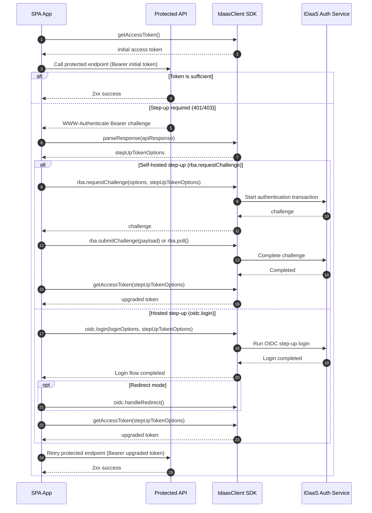

# Step-Up Authentication Guide

This guide explains how to handle API step-up challenges using `IdaasClient.parseResponse(response)`.

After parsing the challenge, you can satisfy it with either:

- Self-hosted authentication using `rba.requestChallenge` (RBA flow)
- Hosted OIDC authentication using `oidc.login`

Use this guide when your protected API returns a `WWW-Authenticate: Bearer` challenge with one of the following errors:

- `insufficient_user_authentication` ([RFC 9470](https://datatracker.ietf.org/doc/html/rfc9470))
- `insufficient_scope` ([RFC 6750](https://datatracker.ietf.org/doc/html/rfc6750))

## When to use this flow

Use these flows when:

- Your app calls a protected API.
- The API indicates the current token is not strong enough or does not have required scope.
- You want to satisfy that challenge by running a step-up authentication and then retrying the API call.

Choose your approach:

- Use `rba.requestChallenge` when you want a fully self-hosted in-app challenge UX.
- Use `oidc.login` when you want to redirect (or popup) to the hosted IDaaS login experience for step-up.

## Expected flow

1. Call your protected API with the current access token.
2. If the response is `401` or `403`, parse the challenge with `parseResponse(response)`.
3. Choose a step-up path:

- Self-hosted path: start a transaction with `idaas.rba.requestChallenge(options, stepUpTokenOptions)`, then complete with `submitChallenge` or `poll`.
- Hosted path: start OIDC login with `idaas.oidc.login(loginOptions, stepUpTokenOptions)`.

4. Obtain an upgraded token that satisfies the parsed challenge.

- Self-hosted path: call `getAccessToken(stepUpTokenOptions)` after challenge completion.
- Hosted path: wait for login completion, then call `getAccessToken(stepUpTokenOptions)`.
- Hosted redirect mode: complete `idaas.oidc.handleRedirect()` before calling `getAccessToken(stepUpTokenOptions)`.

If `stepUpTokenOptions.acrValues` is present, the SDK enforces fail-fast ACR validation while processing returned tokens. The flow throws when the returned access token `acr` claim is missing or does not satisfy any requested value.

5. Retry the protected API call with the upgraded token.

## Sequence diagram



## How to determine which user response to collect

After `rba.requestChallenge`, inspect the returned `challenge.method` and `challenge.pollForCompletion` fields:

- If `pollForCompletion` is `true`, the flow is asynchronous (for example push or face), so prompt the user appropriately and call `poll()`.
- If `pollForCompletion` is `false`, render UI based on `challenge.method` and collect the required user input.

Common submission patterns:

- OTP-like flows: collect a code and submit with `submitChallenge({ response })`.
- Passkey/WebAuthn: perform the browser ceremony and submit with `submitChallenge({ passkeyResponse })`.
- KBA: collect answers and submit with `submitChallenge({ kbaChallengeAnswers })`.

Detailed guidance is already documented in:

- [RBA Guide: Rendering the challenge](./rba.md#rendering-the-challenge)
- [RBA Guide: Submitting the response](./rba.md#submitting-the-response)
- [RBA Guide: Handling common authenticators](./rba.md#handling-common-authenticators)
- [Self-hosted UI examples](../self-hosted.md)

## Example

### Self-hosted step-up with `rba.requestChallenge`

```typescript
import { IdaasClient } from "@entrustcorp/idaas-auth-js";

const idaas = new IdaasClient(
  {
    issuerUrl: "https://example.trustedauth.com",
    clientId: "a1b2c3d4-e5f6-7890-abcd-ef1234567890",
    storageType: "localstorage"
  },
  {
    scope: "openid profile email",
    audience: "https://api.example.com"
  }
);

// 1. Call your protected API with the current access token.
const initialToken = await idaas.getAccessToken();

let apiResponse = await fetch("https://api.example.com/transfers", {
  method: "POST",
  headers: {
    Authorization: `Bearer ${initialToken}`,
    "Content-Type": "application/json"
  },
  body: JSON.stringify({ amount: 1000 })
});

// 2. If the response is 401/403, parse the step-up challenge.
if (apiResponse.status === 401 || apiResponse.status === 403) {
  const stepUpTokenOptions = idaas.parseResponse(apiResponse);

  // 3. Start a new transaction that satisfies the API's requested token constraints.
  const challenge = await idaas.rba.requestChallenge(
    {
      userId: "user@example.com"
    },
    stepUpTokenOptions
  );

  // 4. Complete the challenge with poll() or submitChallenge(...).
  if (challenge.pollForCompletion) {
    await idaas.rba.poll();
  } else {
    // Determine which payload to submit based on challenge.method.
    // See: ./rba.md#rendering-the-challenge, ./rba.md#submitting-the-response,
    // and ./rba.md#handling-common-authenticators for method-specific guidance.
    await idaas.rba.submitChallenge({ response: "123456" });
  }

  // 5. Request a token matching the challenge.
  const upgradedToken = await idaas.getAccessToken(stepUpTokenOptions);

  // 6. Retry the protected API call with the upgraded token.
  apiResponse = await fetch("https://api.example.com/transfers", {
    method: "POST",
    headers: {
      Authorization: `Bearer ${upgradedToken}`,
      "Content-Type": "application/json"
    },
    body: JSON.stringify({ amount: 1000 })
  });
}
```

### Hosted step-up with `oidc.login`

Use this when you want to satisfy the API challenge by sending the user through the hosted OIDC login flow instead of collecting authenticator input directly in your app.

```typescript
import { IdaasClient } from "@entrustcorp/idaas-auth-js";

const idaas = new IdaasClient(
  {
    issuerUrl: "https://example.trustedauth.com",
    clientId: "a1b2c3d4-e5f6-7890-abcd-ef1234567890",
    storageType: "localstorage"
  },
  {
    scope: "openid profile email",
    audience: "https://api.example.com"
  }
);

// 1. Call your protected API with the current access token.
const initialToken = await idaas.getAccessToken();

const apiResponse = await fetch("https://api.example.com/transfers", {
  method: "POST",
  headers: {
    Authorization: `Bearer ${initialToken}`,
    "Content-Type": "application/json"
  },
  body: JSON.stringify({ amount: 1000 })
});

// 2. If the response is 401/403, parse the step-up challenge.
if (apiResponse.status === 401 || apiResponse.status === 403) {
  const stepUpTokenOptions = idaas.parseResponse(apiResponse);

  // 3. Run hosted step-up login with token constraints from the challenge.
  await idaas.oidc.login(
    {
      popup: true
    },
    stepUpTokenOptions
  );

  // 4. After login completes, request a token matching the challenge.
  const upgradedToken = await idaas.getAccessToken(stepUpTokenOptions);

  // 5. Retry the protected API call with the upgraded token.
  await fetch("https://api.example.com/transfers", {
    method: "POST",
    headers: {
      Authorization: `Bearer ${upgradedToken}`,
      "Content-Type": "application/json"
    },
    body: JSON.stringify({ amount: 1000 })
  });
}
```

If you use redirect mode (`popup: false`), call `idaas.oidc.handleRedirect()` on your redirect page to complete login, then call `getAccessToken(stepUpTokenOptions)` and retry the protected API.

## parseResponse behavior

`parseResponse` returns `TokenOptions` you can pass directly into `rba.requestChallenge`, `oidc.login`, and `getAccessToken`.

Challenge parsing follows [RFC 9470](https://datatracker.ietf.org/doc/html/rfc9470) and [RFC 6750](https://datatracker.ietf.org/doc/html/rfc6750).

It may include:

- `acrValues`
- `maxAge`
- `scope`

`parseResponse` throws when:

- The response does not contain a `WWW-Authenticate` header.
- The header does not use the Bearer scheme.
- The challenge error is not supported.

## Related guides

- [OIDC Guide](./oidc.md)
- [RBA Guide](./rba.md)
- [Convenience Auth Guide](./auth.md)
- [Troubleshooting](../troubleshooting.md)
